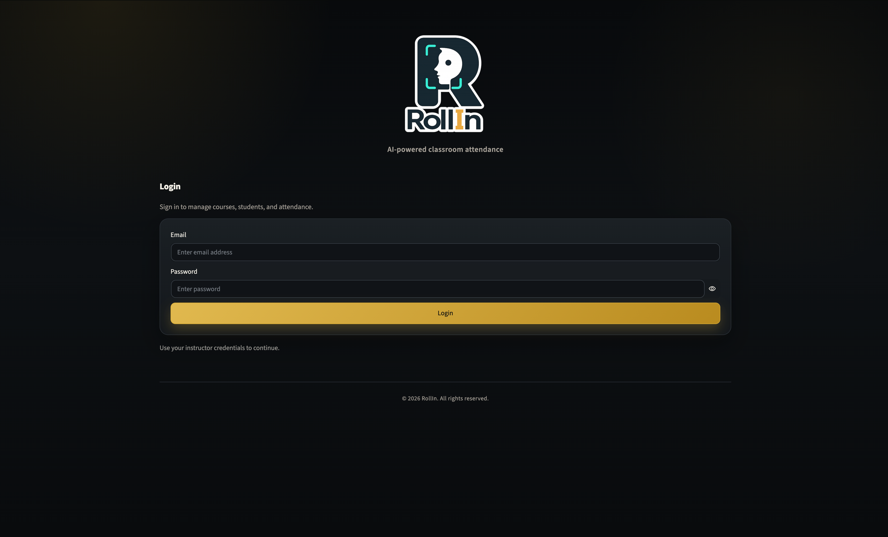
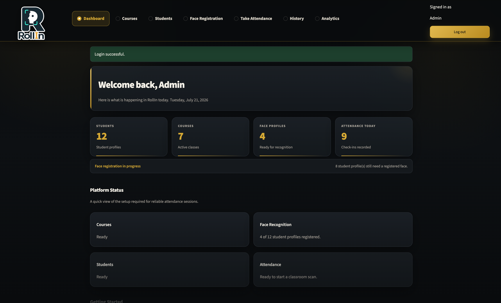
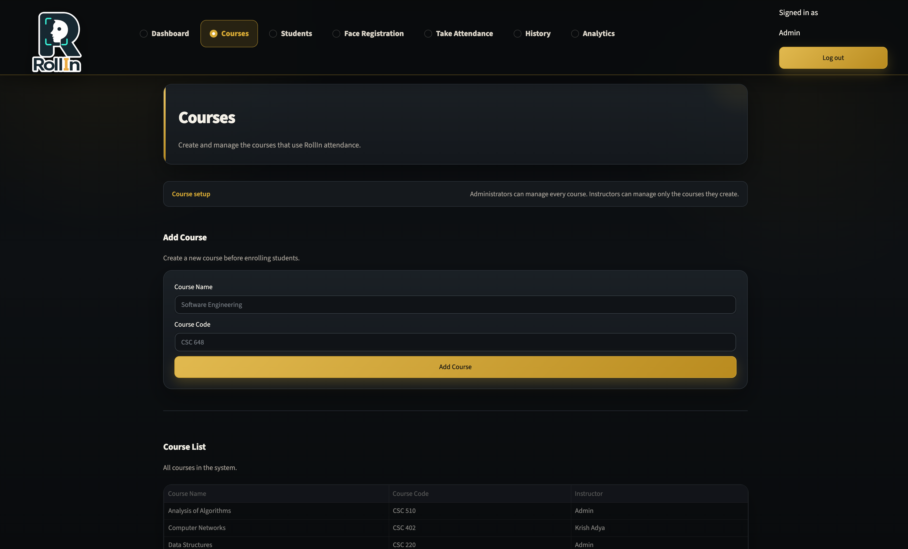
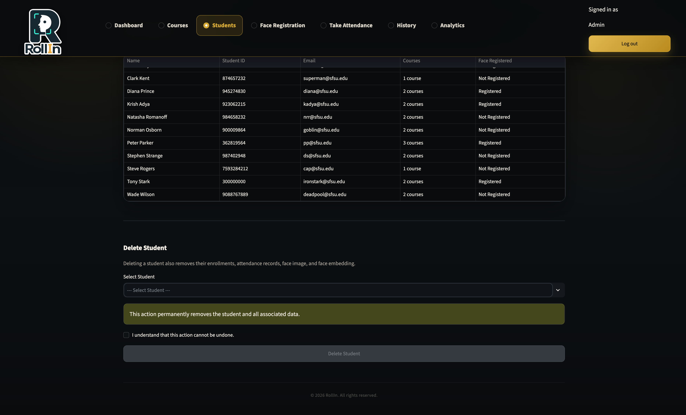
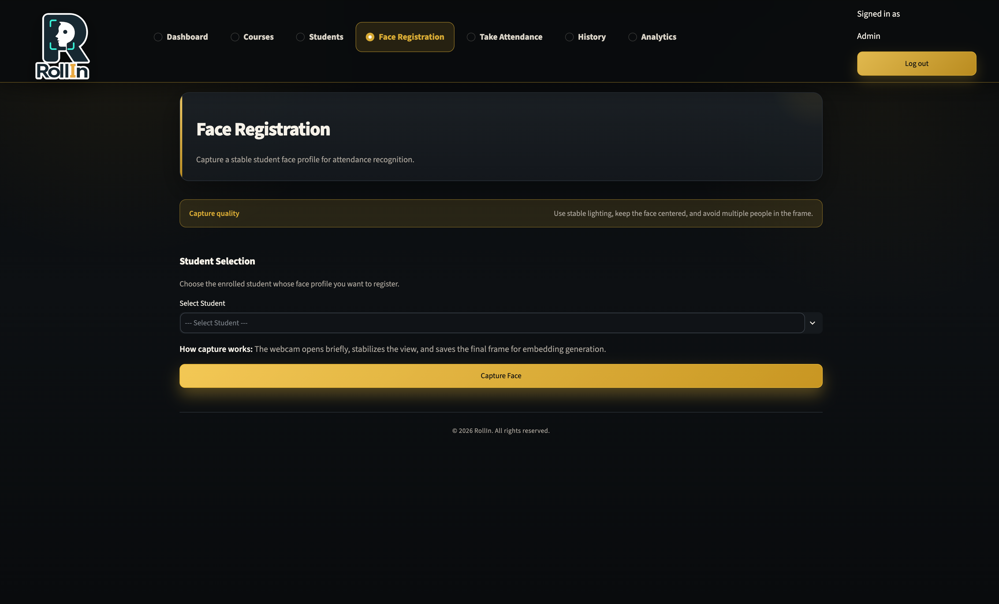
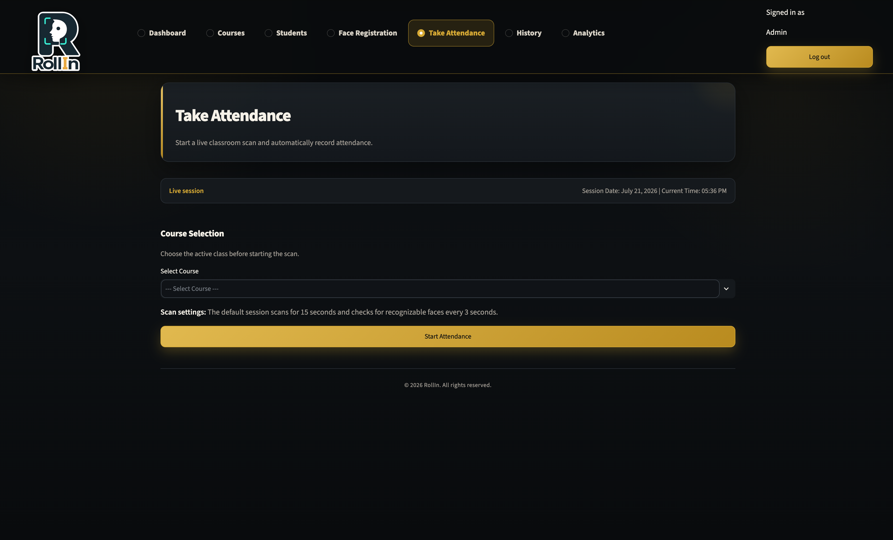
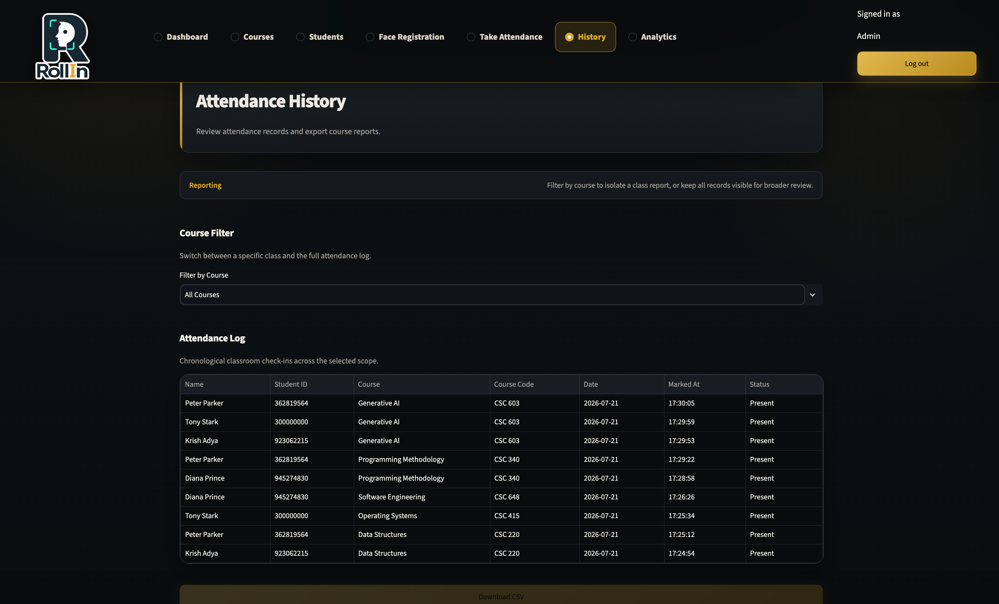
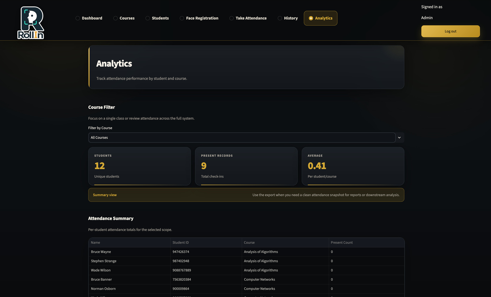
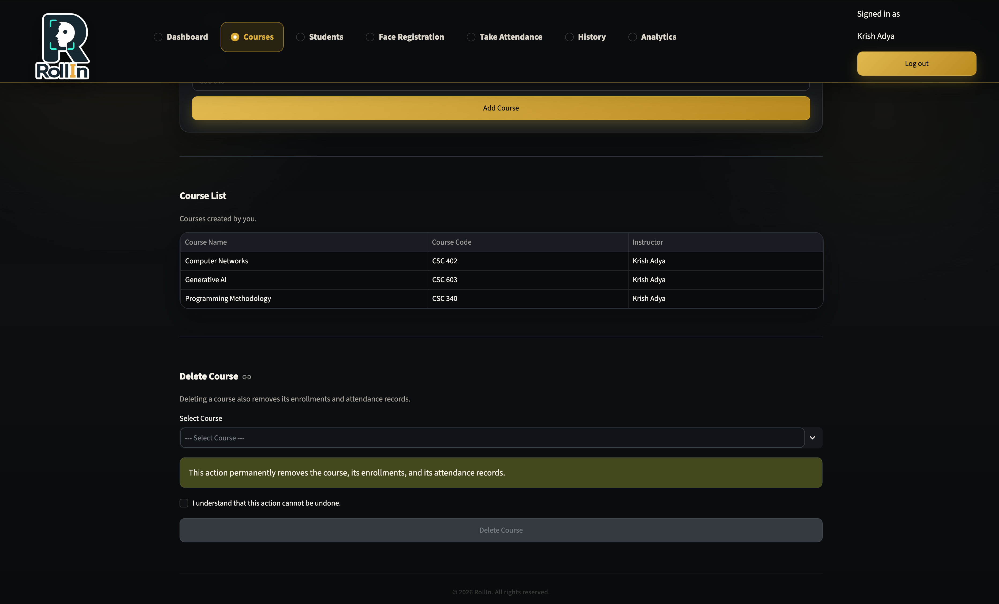

<div align="center">

# RollIn — AI-Powered Classroom Attendance System

**An AI-powered classroom attendance system built with Python, Streamlit, OpenCV, and DeepFace.**

RollIn replaces traditional roll call with facial recognition. Students register their face once, and instructors can mark attendance automatically through a webcam in just a few seconds.

[](https://www.python.org/)
[](https://streamlit.io/)
[](https://github.com/serengil/deepface)
[](https://www.sqlite.org/)
[](#license)

[Demo Accounts](#demo-accounts) • [Installation](#installation) • [Features](#features) • [Screenshots](#screenshots)

</div>

---

## Why I Built This

I built RollIn to explore how facial recognition could be applied to a real classroom workflow. My goal was to combine computer vision, authentication, database design, and role-based access control into one complete application instead of building another standard CRUD project. This project also gave me the opportunity to design a multi-page system where administrators and instructors have different permissions and workflows.

---

## Screenshots

<table>
<tr>
<td width="50%">

**Login**



</td>
<td width="50%">

**Dashboard**



</td>
</tr>

<tr>
<td width="50%">

**Course Management**



</td>
<td width="50%">

**Student Directory**



</td>
</tr>

<tr>
<td width="50%">

**Face Registration**



</td>
<td width="50%">

**Attendance – Before Recognition**



</td>
</tr>

<tr>
<td width="50%">

**Attendance – Successful Recognition**


</td>
<td width="50%">

**Attendance History**



</td>
</tr>

<tr>
<td width="50%">

**Analytics Dashboard**



</td>
<td width="50%">

**Role-Based Access (Instructor View)**



</td>
</tr>
</table>

---

# Features

| | |
|---|---|
| 🧠 **AI Facial Recognition** | Face recognition powered by DeepFace |
| 📸 **Face Registration** | One-time webcam registration for each student |
| ✅ **Real-Time Attendance** | Automatically marks attendance after recognition |
| 🔐 **Role-Based Access Control** | Separate Administrator and Instructor permissions |
| 📚 **Course Management** | Create and manage classroom courses |
| 👨‍🎓 **Student Management** | Student directory with enrollment tracking |
| 🔗 **Course Enrollment** | Assign students to multiple courses |
| 🕒 **Attendance History** | Search and review attendance records |
| 📊 **Analytics Dashboard** | Attendance summaries and statistics |
| 📤 **CSV Export** | Export attendance records |
| 🔑 **Secure Authentication** | Password hashing with PBKDF2 |
| 💻 **Modern UI** | Responsive interface built with Streamlit |

---

# Tech Stack

| Layer | Technology |
|---|---|
| **Frontend** | Streamlit |
| **Backend** | Python |
| **Database** | SQLite |
| **Computer Vision** | OpenCV |
| **Facial Recognition** | DeepFace |
| **Data Processing** | Pandas, NumPy |
| **Security** | PBKDF2 Password Hashing |

---

# System Architecture

```text
                    Webcam
                       │
                       ▼
             Face Registration
                       │
                       ▼
              DeepFace + OpenCV
                       │
                       ▼
             Attendance Processing
                       │
                       ▼
                 SQLite Database
                       │
        ┌──────────────┴──────────────┐
        ▼                             ▼
 Attendance History           Analytics Dashboard
```

---

# How It Works

1. An administrator creates courses and student profiles.
2. Students are enrolled into one or more courses.
3. Student faces are registered using the webcam.
4. During class, the instructor selects a course and starts attendance.
5. DeepFace recognizes registered students in real time.
6. Attendance is automatically recorded in the database.
7. Attendance history and analytics are generated from the stored records.

---

# Project Structure

```text
RollIn/
│
├── app.py
├── auth.py
├── database.py
├── face_utils.py
├── camera_utils.py
├── security.py
├── ui.py
│
├── views/
│   ├── dashboard.py
│   ├── courses.py
│   ├── students.py
│   ├── face_registration.py
│   ├── attendance.py
│   ├── history.py
│   └── analytics.py
│
├── assets/
├── screenshots/
├── data/
└── requirements.txt
```

---

# Installation

Clone the repository.

```bash
git clone https://github.com/krishadya/rollin-ai-attendance.git
```

Move into the project directory.

```bash
cd rollin-ai-attendance
```

Create a virtual environment.

```bash
python -m venv .venv
```

Activate the environment.

**Windows**

```bash
.venv\Scripts\activate
```

**macOS / Linux**

```bash
source .venv/bin/activate
```

Install the required dependencies.

```bash
pip install -r requirements.txt
```

Run the application.

```bash
streamlit run app.py
```

---

# Demo Accounts

> These accounts are seeded automatically for local testing.

| Role | Email | Password |
|------|-------|----------|
| **Administrator** | `admin@rollin.com` | `admin123` |
| **Instructor** | `krish@rollin.com` | `krish473` |

---

# What I Learned

Building RollIn helped me gain experience with:

- Designing a multi-page application using Streamlit.
- Building CRUD operations with SQLite.
- Integrating DeepFace and OpenCV for facial recognition.
- Implementing authentication and role-based authorization.
- Designing a relational database for courses, students, enrollments, and attendance.
- Improving the user experience through multiple UI iterations.
- Organizing a larger Python project into reusable and maintainable modules.

---

# Future Improvements

- [ ] Multi-face attendance in a single frame
- [ ] Docker deployment
- [ ] Cloud database support
- [ ] Mobile application
- [ ] Email notifications
- [ ] LMS integration (Canvas / Moodle)
- [ ] Live attendance dashboard

---

# License

This project was created for educational and portfolio purposes.

---

<div align="center">

### Built by Krish Adya

</div>